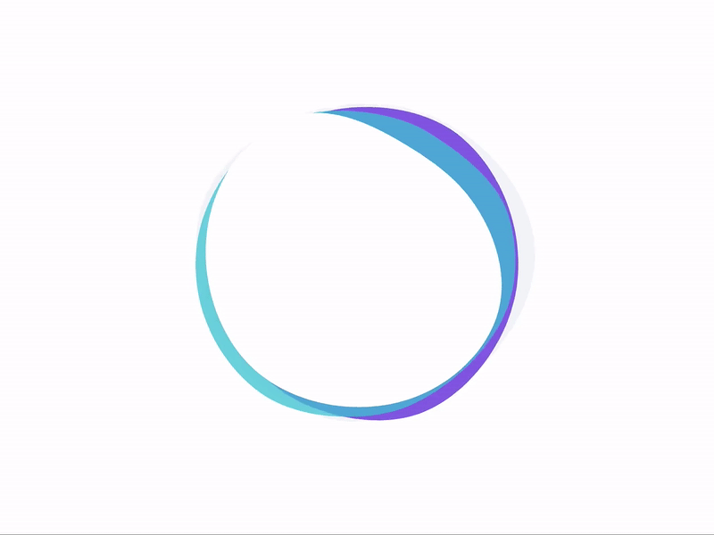

  

### Hey!

I'm **Badis**, a Software Developer from Paris with more than 8+ years experience with a strong passion for all things open source.

 

 

Ever since I joined GitHub **{{ ACCOUNT_AGE }}** years ago, I pushed **{{ COMMITS }}** commits, opened **{{ ISSUES }}** issues, submitted **{{ PULL_REQUESTS }}** pull requests, received **{{ STARS }}** stars across **{{ REPOSITORIES }}** personal projects, and contributed to **{{ REPOSITORIES_CONTRIBUTED_TO }}** public repositories.
